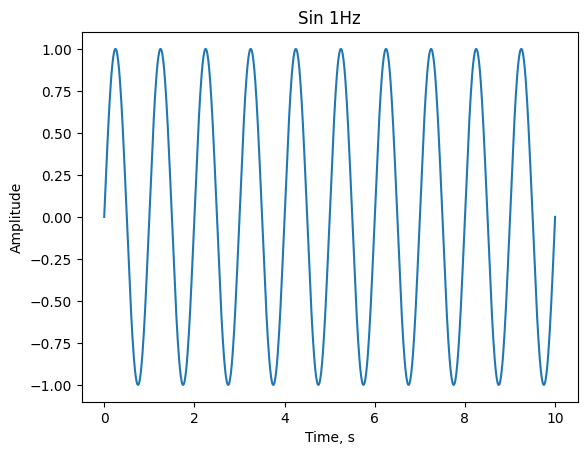

# signal-design

Simple way to create signals.

## The project is intended for designing signals.

The package is intended to create and develop signals of
varying complexity.

The project can be used both for educational and work purposes.

It is convenient to use [`Jupyter Lab`](https://jupyter.org/) or
[`Jupyter Notebook`](https://jupyter.org/) to speed up the development
of signals, to compare their parameters with other signals,
and to visualize them.

The project is designed so that you can easily change the creation of
signals.

In addition, documentation consist tutorial how to work with library
and examples of ready-made signals. You can write own signal creation.

# Installation

To install use:

```bash
$ pip install signal-design
```

or using `poetry`

```bash
$ poetry add signal-design
```

Also you can clone or load project from [GitHub](https://github.com/Omnivanitate/signal-design),
and install requirement packages using the

```bash
$ pip install -r requirements/build.txt
```

or if you want develop, use

```bash
$ pip install -r requirements/dev.txt

```

or

```bash
$ poetry install
```

or coping pieces of code and create your own.

## Usage

The project is a library. Working with it is the same as with
other third-part libraries of the python language.  
An example of how to include the library is described
[here](https://docs.python.org/3/tutorial/modules.html).

The library consists sub-modules:

- `signal_design.core` - contains basic classes `MathOperation` and `RelationProtocol`.
- `signal_design.exc` - contains exceptions.
- `signal_design.axis` - contains class `Axis`
- `signal_design.relation` - contains class `Relation`
- `signal_design.signal` - contains class `Signal`
- `signal_design.spectrum` - contains class `Spectrum`
- `signal_design.default_methods` - contains default methods for class above.

For convenient base classes:
`Axis`, `Relation`, `Signal`, `Spectrum` - can be imported from
the `signal_design` module.

For example:

```python
from signal_design import Signal
```

### Quick start. Simple work flow.

Below is a simple example of creating a signal and visualizing it.
A more extended description of the work of the library in the documentation.
Other examples are contained in the documentation contains in _Tutorial_
section.

For the following code [`Matplotlib`](https://matplotlib.org/) need be used
to visualize a result of work. But `Matplotlib` can be replaced with another
library that you use.

```python
import numpy as np
import matplotlib.pyplot as plt

from signal_design import Axis, Signal

time = Axis.get_using_end(start=0., end=10., sample=0.01)
amplitude = np.sin(2*np.pi*time.array)
signal = Signal(time, amplitude)

plt.plot(*signal.get_data())
plt.xlabel('Time, s')
plt.ylabel('Amplitude')
plt.title('Sin 1Hz')
```

Result:



## Credits

`signal-design` was created with  
[`numpy`](https://numpy.org/)  
[`scipy`](https://scipy.org/)
